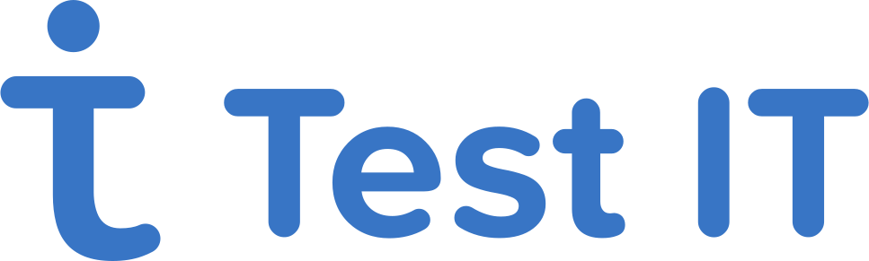

.png)

Меня зовут Денис Белоголовый. Начинающий инженер по обеспечению качества. Здесь собрано моё портфолио на основе текущего проекта.


## Содержание:

+ [Контакты](#clipboard-Контакты)
+ [Стек технологий](#clipboard-Стек-технологий)
+ [Тестовые артефакты](#clipboard-Тестовые-артефакты)
+ [Сертификаты](#clipboard-Сертификаты)


## :wave: Мои контакты:

:icecream: <a target="_blank" href="https://t.me/runciterr">telegram</a>
:doughnut: <a target="_blank" href="https://www.linkedin.com/in/denis-belogoloviy-01924b258/">linkedIn</a>
:fried_shrimp: e-mail: Dbelogoloviy@yandex.ru </a>


## :computer: Стек технологий
<p align="center">
<a href="https://https://linux.org/)/"></a>
<a href="https://https://testit.software/"></a>
<a href="https://github.com/"></a>
<a href="https://www.about.gitlab.com/"></a>
<a href="https://docker.com/"></a>
<a href="https://DevToolshere/"></a>
<a href="https://sonatype.com/products/nexus-repository/"></a>
<a href="https://postman.com/"></a>
<a href="https://dbeaver.io.com/"></a>
<a href="https://dbeaver.io.com/"></a>
<a href="https://www.jenkins.io/"></a>
<a href="https://www.atlassian.com/software/jira"></a>
<a href="https://trackstudio.ru/"></a>
</p>

## :clipboard: Мои тестовые артефакты на текущем проекте: 
+ :white_check_mark: Баг-репорты
+ :white_check_mark: Тест-кейсы и чек-листы
+ :white_check_mark: Чек-листы


## :desktop_computer: Команды запуска тестов в терминале
#### Команды для локального запуска:
```bash
./gradlew clean taskWithTagVacancy -Dhost=localLaunch
```

#### Команды для удаленного запуска:
```bash
clean
taskWithTagVacancy
-DremoteLink=${REMOTE_LINK}
-Dbrowser=${BROWSER}
-Dversion=${BROWSER_VERSION}
-Dresolution=${BROWSER_RESOLUTION}
-Dhost=remoteLaunch
```
