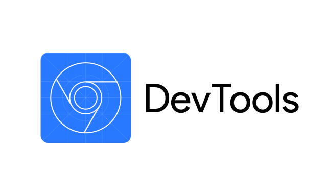

.png)

#### Меня зовут Денис Белоголовый. QA инженер в Газпром Медиа Холдинге. Здесь собрано моё портфолио на основе текущих и прошлых проектов, а также домашние задания по автоматизации тестирования на Java.

## Содержание:

+ [Мои контакты](#wave-Мои-контакты)
+ [Используемые инструменты и технологии](#computer-Используемые-инструменты-и-технологии)
+ [Над какими проектах работал](#clipboard-Над-какими-проектах-работал)
+ [Мои тестовые артефакты](#clipboard-Мои-тестовые-артефакты)
+ [Сертификаты о дополнительном образовании](#clipboard-Сертификаты-о-дополнительном-образовании)

## :wave: Мои контакты

:icecream: <a target="_blank" href="https://t.me/runciterr">telegram</a>
:doughnut: <a target="_blank" href="https://www.linkedin.com/in/denis-belogoloviy-01924b258/">linkedIn</a>
:fried_shrimp: e-mail: Dbelogoloviy@yandex.ru </a>

## :computer: Используемые инструменты и технологии

Газпром Медиа Холдинг

  

ПАО Сбербанк

НИИ СОКБ

## :clipboard: Над какими проектах работал
НИИ СОКБ

Проект: Mobile Device Management система для удалённого управления корпоративными мобильными устройствами и обеспечения их информационной безопасности.

ПАО Сбербарнк

Проект: Динамический баланс (Модель прогнозирования финансовых показателей банка).

Газпром Медиа Холдинг 

Проекты: Сервис по созданию коротких видео из потока; Движок для создания мультимедиа сайтов; Бэкенд онлайн кинотеатра Premier; Сайт с вакансиями холдинга.

## :clipboard: Мои тестовые артефакты 
+ :white_check_mark: [Чек-лист мобильного тестирования](https://github.com/Runciterr/mobile-testing-check-list)

## :clipboard: Сертификаты о дополнительном образовании
:diamond_shape_with_a_dot_inside: [Сертификаты](https://github.com/Runciterr/certificates)
